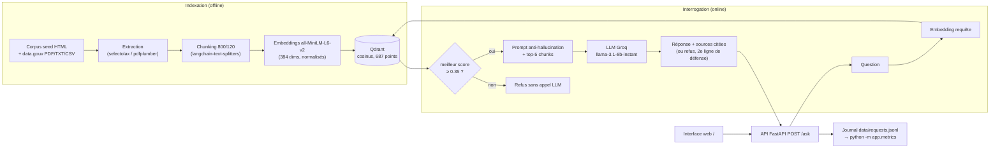

# Compte rendu — AssistKB Search (Projet A)

## 1. Présentation

**Équipe** (3 membres, rôle R4 mutualisé avec R1) :

| Membre | Rôle | Étage | Fichiers principaux |
|---|---|---|---|
| Joud (Joud04) | R1 + R4 | Ingestion / DevOps & métriques | `app/ingest.py`, `scripts/`, `docker-compose.yml`, `app/metrics.py` |
| Walid Hdilou | R2 | Embeddings / Index | `app/embed.py`, `app/store.py`, `eval/` |
| Amine Kaoutar | R3 | Retrieval / LLM / API | `app/retrieve.py`, `app/generate.py`, `app/main.py`, `static/` |

**Dépôt** : https://github.com/Joud04/machine_learning

## 2. Objectif

Construire l'assistant interne **AssistKB** pour l'ESN fictive Neosoft : un
pipeline RAG complet qui répond aux questions des consultants **uniquement à
partir du corpus indexé** (base de connaissances seed + documents publics
data.gouv.fr), en citant ses sources, et qui **refuse de répondre** plutôt que
d'halluciner lorsque le corpus ne contient pas l'information. L'angle dominant
du projet A est la **qualité du retrieval** : choix du top-k justifié par des
mesures, seuil de refus calibré, évaluation sur golden dataset et reranking en
bonus.

## 3. Architecture



Deux conteneurs orchestrés par docker-compose : **qdrant** (vector store,
volume persistant, healthcheck) et **api** (FastAPI + UI statique), l'API ne
démarrant qu'une fois Qdrant sain.

## 4. Fonctionnement

Parcours d'une question (`POST /ask`) :

1. La question est vectorisée avec le même modèle que le corpus
   (`all-MiniLM-L6-v2`, vecteurs normalisés → similarité cosinus).
2. Qdrant renvoie les **top-k = 5** chunks avec leur score (une seule recherche,
   les scores servent aussi au seuil).
3. **Seuil de refus** : les chunks sous `SIM_THRESHOLD = 0.35` sont écartés.
   S'il ne reste rien, l'API refuse **sans appeler le LLM** (0 token consommé).
   Le seuil a été calibré en observant les scores réels : les questions
   in-corpus obtiennent 0.45–0.62, les questions clairement hors sujet ~0.25–0.35.
4. Sinon, le LLM (Groq) reçoit un prompt strict : répondre uniquement à partir
   du contexte fourni, citer `[source N]`, et répondre exactement
   « *Je ne dispose pas de cette information dans le corpus.* » si le contexte
   ne suffit pas.
5. **Deuxième ligne de défense** : certaines questions hors corpus passent le
   seuil (le corpus data.gouv, très hétérogène, « matche » faiblement avec tout).
   Si le LLM renvoie la formule de refus, l'API marque `refused=true` et vide la
   liste des sources, pour rester cohérente.
6. Chaque requête est journalisée (`data/requests.jsonl`) : score top-1, refus,
   latence, tokens — agrégés par `python -m app.metrics`.

L'interface web (servie sur `/`) affiche la conversation et un panneau
« Sources citées » avec score et position de chaque chunk.

## 5. Structure du projet

```
machine_learning/
├── README.md, docker-compose.yml, Dockerfile, .env.example, requirements.txt
├── scripts/        fetch_corpus.sh, fetch_datagouv.py, experiment.py (top-k)
├── corpus/seed/    7 documents internes Neosoft (committés)
├── corpus/raw/     corpus data.gouv téléchargé (gitignoré)
├── app/            ingest.py, embed.py, store.py, retrieve.py, generate.py,
│                   main.py (API + UI), metrics.py, config.py
├── static/         index.html (interface de chat)
├── eval/           golden.jsonl (10 questions), recall.py (recall@k, MRR)
├── tests/          test_retrieve.py, test_generate.py (pytest)
└── docs/           COMPTE-RENDU.md, captures/
```

## 6. Choix techniques

| Choix | Pourquoi |
|---|---|
| `all-MiniLM-L6-v2` (local, 384 dims) | Gratuit, rapide sur CPU, suffisant pour du retrieval sémantique FR/EN |
| Vecteurs normalisés + distance cosinus | Cohérence embedding/index ; scores bornés [0,1] exploitables pour le seuil |
| Qdrant | Vector store imposé du projet A ; API simple, healthcheck, volume persistant |
| Chunking récursif 800 caractères / overlap 120 | Assez grand pour du contexte, assez petit pour rester précis ; l'overlap évite de couper une information à la frontière |
| Ids `uuid5(source:position)` déterministes | Ré-indexation **idempotente** : un upsert écrase au lieu de dupliquer |
| `TOP_K = 5` | Justifié par l'expérimentation (section 7) : le recall plafonne au-delà |
| `SIM_THRESHOLD = 0.35` + 2e ligne de défense LLM | Le seuil seul ne suffit pas sur corpus hétérogène (défense en profondeur) |
| Groq `llama-3.1-8b-instant`, température 0.1 | Free tier, très faible latence de génération, réponses factuelles stables |
| LangChain (wrapper Qdrant + ChatGroq) | Lecture directe de `usage_metadata` (tokens) et DI facilitant les tests unitaires |
| Reranking cross-encoder `ms-marco-MiniLM-L-6-v2` (bonus) | Reclasse le top-20 vectoriel par pertinence fine question/passage |

## 7. Résultats

### Qualité du retrieval (golden dataset, 10 questions sur le corpus seed)

```bash
python -m eval.recall 5        # recall@5 = 0.90 (9/10), MRR = 0.900
python -m scripts.experiment   # tableau comparatif top-k
```

| k | recall@k | MRR | latence retrieval moy. (ms) |
|---|----------|-----|------------------------------|
| 1 | 0.90 | 0.900 | 34.2 |
| 3 | 0.90 | 0.900 | 29.9 |
| 5 | 0.90 | 0.900 | 29.9 |
| 10 | 1.00 | 0.914 | 31.1 |

La bonne source est presque toujours au **rang 1** (recall@1 = 0.90,
MRR = 0.900) : le retrieval est précis. Une seule question (« latence cible »)
n'est rattrapée qu'à un rang profond, d'où recall@10 = 1.00 — mais le MRR ne
progresse quasiment pas (0.900 → 0.914) : gain marginal. **`TOP_K=5` est le bon
compromis** — au-delà, le contexte envoyé au LLM grossit (coût et latence de
génération en hausse) sans bénéfice de pertinence.

### Exploitation (`python -m app.metrics`, 16 requêtes réelles)

| Métrique | Valeur |
|---|---|
| Score de similarité moyen (top-1) | 0.509 |
| Taux de refus | 37.5 % |
| Latence p50 | 690 ms |
| Latence p95 | 16 643 ms (*) |
| Tokens moyens entrée / sortie | 1 271 / 225 |
| Coût projeté pour 1 000 questions | 0,082 USD |

(*) Le p95 provient d'une salve de tests rapprochés qui a déclenché le **rate
limiting du free tier Groq** (attentes avant ré-essai). En usage espacé, la
latence observée est de 0,4 à 1,3 s par question.

### Comportement anti-hallucination (vérifié)

- Question in-corpus (« architecture d'AssistKB v0 ») → réponse sourcée,
  meilleur score 0.505 — capture : `docs/captures/ui-reponse-sources.png`.
- Question hors corpus (« coupe du monde 1998 ») → score 0.37, refus par seuil
  côté LLM — capture : `docs/captures/ui-refus-hors-corpus.png`.
- Question hors corpus passant le seuil (« recette de tarte tatin », 0.493) →
  refus par la **2e ligne de défense** (formule de refus du LLM détectée,
  `refused=true`, sources vidées).

## 8. Difficultés et limites

- **Le seuil de similarité seul ne suffit pas.** Les gros documents TXT
  data.gouv « matchent » faiblement avec presque tout : une question hors
  corpus peut dépasser 0.35 (ex. 0.49). D'où la défense en profondeur : seuil
  **puis** formule de refus imposée au LLM et détectée par l'API.
- **Crash au premier démarrage sur volume vierge.** Le wrapper LangChain de
  Qdrant exige que la collection existe à l'initialisation. Corrigé en créant
  la collection (vide) au démarrage de l'API et en instanciant les services à
  la demande plutôt qu'à l'import.
- **Rate limiting Groq.** En salve, le free tier impose des attentes (p95 à
  16,6 s). Mesure à interpréter comme une limite du free tier, pas du pipeline
  (p50 = 690 ms).
- **Indexation pilotée depuis l'hôte.** Le corpus data.gouv (gitignoré) est
  téléchargé et indexé depuis la machine hôte vers le Qdrant du compose
  (port 6333 publié) ; l'image ne contient que le corpus seed. Limite assumée
  pour garder une image légère.
- **Évaluation sur le corpus seed uniquement.** Le golden dataset est ancré sur
  les documents seed (déterministes et reproductibles) ; le corpus data.gouv
  change à chaque téléchargement et ne peut pas servir de référence stable.

---

## Annexe — détails par étage

### R1 — Ingestion (Joud)

- **`scripts/fetch_corpus.sh` / `fetch_datagouv.py`** : récupération de
  documents publics via l'API data.gouv.fr (`DATA_QUERY`, `N_DOCS`, formats
  pdf/json/csv/txt, plafond 5 Mo par fichier) vers `corpus/raw/datagouv/`.
- **`app/ingest.py`** : extraction multi-format — HTML avec `selectolax`
  (suppression script/style), PDF avec `pdfplumber`, JSON sérialisé, TXT/MD/CSV
  lus tels quels — puis chunking `RecursiveCharacterTextSplitter` (800/120).
- Chaque chunk : `{"id": uuid5(source:position), "text", "metadata": {source,
  doc_type, position}}` → `data/chunks.jsonl` (**687 chunks** : seed + data.gouv).
  L'id déterministe rend toute la chaîne aval idempotente.

### R2 — Embeddings + index Qdrant (Walid)

- **`app/embed.py`** — vectorisation avec `all-MiniLM-L6-v2`
  (`sentence-transformers`), par batch de 64, vecteurs **normalisés**
  (`normalize_embeddings=True`, cohérent avec la distance cosinus).
  - `embed_texts(texts)` : vectorisation par lot.
  - `embed_query(text)` : vectorisation d'une requête unique (utilisé par R3).
  - `python -m app.embed` : lit `data/chunks.jsonl` et indexe l'ensemble.
- **`app/store.py`** — classe `QdrantStore` :
  - `ensure_collection()` : crée la collection en distance **cosinus**,
    dimension **384**, uniquement si elle n'existe pas (ré-exécution sûre).
  - `upsert(points)` : insertion/mise à jour idempotente (ids `uuid5`).
  - `search(vector, top_k)` : renvoie `[{score, text, metadata}]`.
- Vérifications : 687 chunks → 687 points (dimension 384, distance Cosine),
  ré-exécution de `app.embed` sans duplication (687 → 687).
- **Évaluation retrieval (étapes 8.1 et 9)** : golden dataset
  (`eval/golden.jsonl`), `eval/recall.py` (recall@k, MRR) et
  `scripts/experiment.py` (comparatif top-k) — résultats en section 7.

### R3 — Retrieval, génération, API, UI (Amine)

- **`app/retrieve.py`** : `RetrievalService` (wrapper LangChain sur Qdrant,
  injection de dépendances pour les tests) ; `retrieve_with_scores` renvoie les
  paires (document, score cosinus) en une seule recherche. **Bonus étape 10** :
  `rerank()` — top-20 vectoriel reclassé par le cross-encoder
  `ms-marco-MiniLM-L-6-v2`.
- **`app/generate.py`** : prompt système strict en français (sources `[source N]`,
  formule de refus exacte imposée), `ChatGroq` température 0.1, tokens lus dans
  `usage_metadata`.
- **`app/main.py`** : `POST /ask` (réponse, sources, refus, score, latence,
  tokens), `GET /health`, UI servie sur `/`.
- **`static/index.html`** : interface de chat (envoi de question, réponse,
  panneau des sources citées avec scores). `test_api.py` : vérification
  manuelle de bout en bout.

### R4 — DevOps & observabilité (Joud)

- **`Dockerfile` + `docker-compose.yml`** : stack complète en une commande
  (`docker compose up -d --build`) — Qdrant avec volume persistant et
  healthcheck, API qui attend Qdrant sain (`depends_on: condition:
  service_healthy`), `restart: unless-stopped`, caches HuggingFace et données en
  volumes nommés.
- **`app/metrics.py`** : journalisation JSONL de chaque requête puis agrégation
  chiffrée (`python -m app.metrics`) — score moyen top-1, taux de refus,
  latences p50/p95, tokens moyens, coût projeté pour 1 000 questions.
- Fiabilisation du démarrage : création de la collection à l'init de l'API
  (premier boot sur volume vierge).
